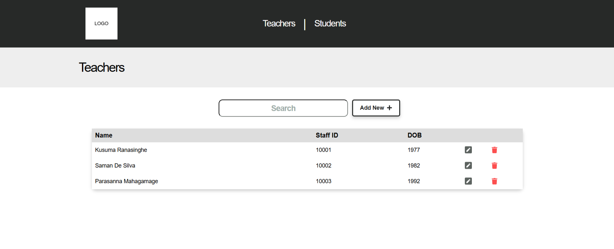

# 🏫 School Information Management System

A full-stack school information management system developed as the capstone project for the University of Moratuwa's Trainee Full-Stack Developer Programme. The application provides a simple interface for managing teacher and student records through an Angular frontend, an Express REST API, and a SQLite database.

---

## 📑 Table of Contents

- [🔍 Overview](#-overview)
  - [🎯 The Project](#-the-project)
  - [✨ Features](#-features)
  - [📸 Screenshot](#-screenshot)
  - [🔗 Links](#-links)
- [⚙️ My Process](#️-my-process)
  - [🛠 Built With](#-built-with)
  - [📚 What I Learned](#-what-i-learned)
  - [🚀 Continued Development](#-continued-development)
- [💻 Getting Started](#-getting-started)
  - [✅ Prerequisites](#-prerequisites)
  - [📦 Installation](#-installation)
  - [▶️ Running the Application](#️-running-the-application)
  - [🧪 Testing](#-testing)
- [📁 Project Structure](#-project-structure)
- [👩‍💻 Author](#-author)
- [🙏 Acknowledgements](#-acknowledgements)

---

## 🔍 Overview

### 🎯 The Project

This project is a web-based information management system for maintaining student and teacher records. It demonstrates how a frontend application can communicate with a REST API to perform CRUD operations on data stored in a relational database.

The system allows users to:

- View all teachers and students
- Add new teacher and student records
- Retrieve individual records for editing
- Update existing teacher and student information
- Delete teacher and student records
- Search for teachers and students by name
- Reset and seed the database with sample data

### ✨ Features

- Separate teacher and student management interfaces
- Complete CRUD functionality for both record types
- Case-insensitive name searching
- Angular routing between list, add, and edit pages
- Reusable Angular service for backend communication
- RESTful data exchange using JSON
- Parameterized SQL queries
- SQLite database migrations and seed data
- Automated backend and browser-based test suites
- Responsive web interface

### 📸 Screenshot



### 🔗 Links

- **GitHub Repository:** [capstone-project-assignment-dulaagamage](https://github.com/OpenUOM/capstone-project-assignment-dulaagamage)
- **Programme:** [University of Moratuwa Open Learning Platform](https://open.uom.lk/)

---

## ⚙️ My Process

### 🛠 Built With

#### Frontend

- **Angular 10**
- **TypeScript**
- **HTML5**
- **CSS3**
- **Angular Router**
- **Angular HttpClient**
- **RxJS**
- **Font Awesome**

#### Backend

- **Node.js**
- **Express.js**
- **SQLite**
- **Knex.js**
- **Body Parser**

#### Testing and Development

- **Jest**
- **Supertest**
- **TestCafe**
- **Git and GitHub**
- **GitHub Classroom**
- **VS Code**

### 📚 What I Learned

This project gave me hands-on experience in:

- Building a full-stack application with Angular and Node.js
- Designing frontend components for listing, adding, editing, and deleting records
- Creating and consuming REST API endpoints
- Using Angular services and observables for HTTP communication
- Configuring client-side navigation with Angular Router
- Implementing CRUD operations with SQL
- Protecting database queries with positional parameter binding
- Managing database schemas using Knex migrations
- Populating a database using seed files
- Implementing case-insensitive search functionality
- Testing Express endpoints with Jest and Supertest
- Using Git and GitHub to manage and submit a software project

### 🚀 Continued Development

Possible future improvements include:

- Add user authentication and role-based authorization
- Add form validation and clearer error messages
- Add pagination and sorting for large datasets
- Add advanced filtering for student and teacher records
- Improve mobile responsiveness and accessibility
- Add confirmation dialogs before deleting records
- Replace SQLite with MySQL or PostgreSQL for production use
- Upgrade Angular and project dependencies to supported versions
- Deploy the frontend and backend to cloud hosting platforms
- Add continuous integration for automated testing

---

## 💻 Getting Started

### ✅ Prerequisites

Install the following software before running the project:

- [Node.js](https://nodejs.org/)
- [Git](https://git-scm.com/)
- A modern web browser such as Google Chrome

> **Compatibility note:** This project uses Angular 10. Node.js 16.20.2 is recommended because newer Node.js releases may be incompatible with the older Angular development tooling.

### 📦 Installation

1. Clone the repository:

```bash
git clone https://github.com/OpenUOM/capstone-project-assignment-dulaagamage.git
```

2. Open the project directory:

```bash
cd capstone-project-assignment-dulaagamage
```

3. Install the backend dependencies:

```bash
npm install
```

4. Install the frontend dependencies:

```bash
cd frontend
npm install
cd ..
```

5. Create and seed the database:

```bash
npm run db
```

### ▶️ Running the Application

Start the backend from the project root:

```bash
npm start
```

Open a second terminal, navigate to the frontend directory, and start Angular:

```bash
cd frontend
npm start
```

Open the application in your browser:

```text
http://localhost:4200
```

The backend API runs at:

```text
http://localhost:8080
```

### 🧪 Testing

Run the backend test suite from the project root:

```bash
npm test
```

Build the Angular frontend to verify compilation:

```bash
cd frontend
npm run build
```

---

## 📁 Project Structure

```text
capstone-project-assignment-dulaagamage/
├── backend/
│   ├── migrations/
│   ├── seeds/
│   ├── test/
│   ├── database.js
│   ├── index.js
│   └── server.js
├── docs/
├── frontend/
│   ├── src/
│   │   └── app/
│   │       ├── components/
│   │       ├── app-routing.module.ts
│   │       └── app-service.service.ts
│   └── test/
├── knexfile.js
└── package.json
```

---

## 👩‍💻 Author

- **GitHub:** [@dulaagamage](https://github.com/dulaagamage)
- **LinkedIn:** [Dulanjalee Gamage](https://www.linkedin.com/in/dulanjalee-gamage-01a7aa207/)
- **Email:** dulaagamage123@gmail.com

---

## 🙏 Acknowledgements

This project was completed as part of the **Trainee Full-Stack Developer Programme** offered through the University of Moratuwa Open Learning Platform.

Special thanks to the programme instructors and contributors for providing the starter project, documentation, automated tests, and learning resources used during the development of this capstone project.

---

⭐ If you found this project useful, feel free to explore the repository and share your feedback.
